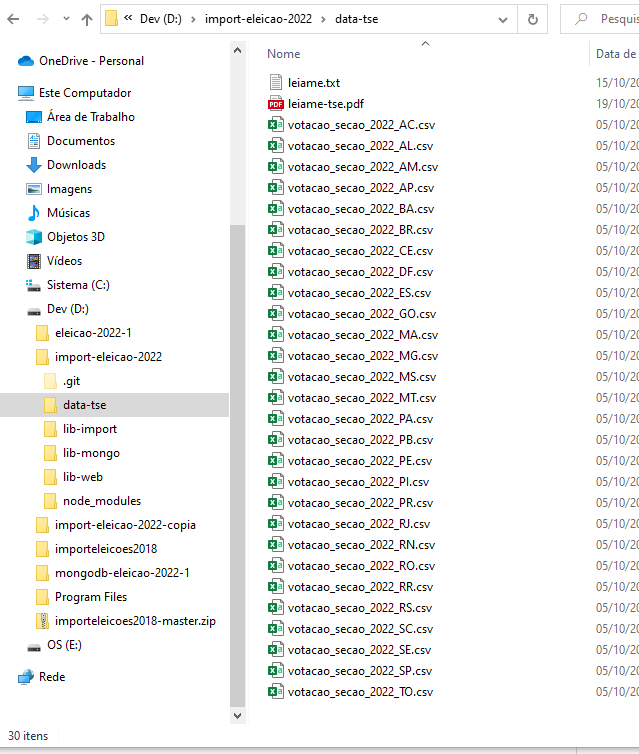

# Importar Dados do TSE - eleições 2022 - 1º turno

## Precisa instalar:
    NodeJS: 14
    MongoDB: 6

Para executar o import:
> npm run import1

Para a consultar web:
> npm start

Baixe os arquivos da página do TSE, e salve na pasta data-tse, precisa fazer o unzip dos arquivos:
https://dadosabertos.tse.jus.br/dataset/resultados-2022

Exemplo pasta data-tse:

Exemplo retorno consulta web:

Exemplo urna em trânsito:
https://resultados.tse.jus.br/oficial/app/index.html#/eleicao;e=e544;uf=ap;ufbu=ap;mubu=06050;zn=0002;se=0824/dados-de-urna/boletim-de-urna
