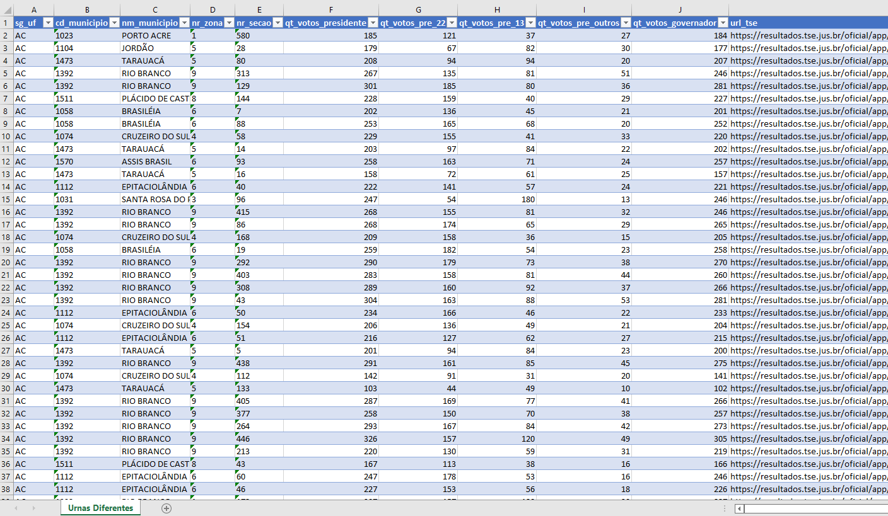
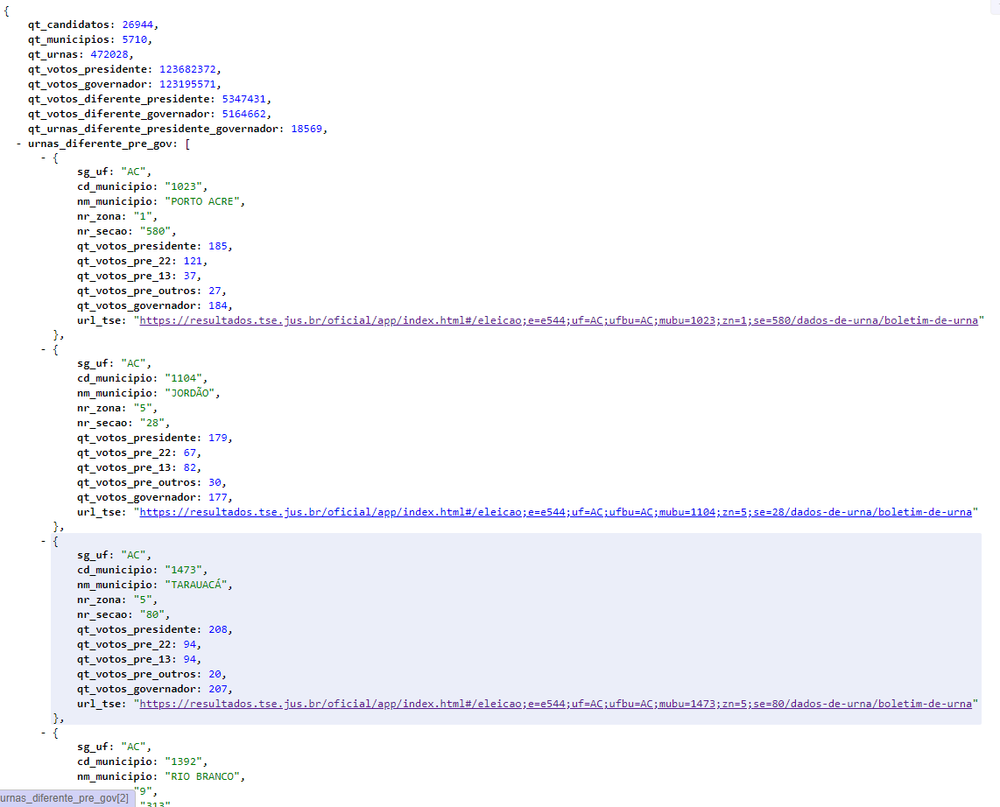

# Importar Dados do TSE - eleições 2022 - 1º turno

## Precisa instalar:
    NodeJS: 14
    MongoDB: 6

Para executar o import:
> npm run import1

Para a consultar web:
> npm start


## Baixe os arquivos da página do TSE, e salve na pasta 'data-tse', precisa fazer o unzip dos arquivos:
https://dadosabertos.tse.jus.br/dataset/resultados-2022

Como deve ficar a pasta 'data-tse':


## Exemplos de consultas

Existem 18569 urnas com mais votos em presidentes, em relação a quantidade de votos em governadores:
[urnas_diferentes_18569.xlsx](./tmp/urnas_diferentes_18569.xlsx)


Retorno da consulta web:
[result_http.json](./tmp/result_http.json)



## Para obter o arquivo em mongodb já gerado pelo ```npm run import```, baixe do projeto:
https://github.com/jonasvix/mongodb-eleicao-2022-1
